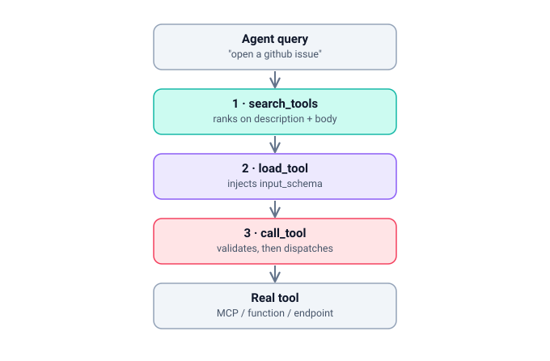
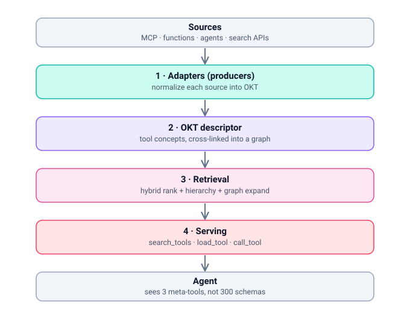

# OKTS — Open Knowledge Tool Search

**Give your agent 300 tools. It only ever sees 3.**

OKTS is a source-agnostic wrapper that ingests tools from anywhere — MCP servers, plain function schemas, sub-agents, OpenAPI/HTTP endpoints, search APIs — describes each one as a portable [OKT](#the-okt-format) markdown file, indexes them with graph-aware retrieval, and exposes a stable three-tool interface to any agent. The agent searches for the tool it needs, loads that one schema on demand, and calls it. Nothing else touches the context window.

> **OKT** (Open Knowledge Tools) is the *format* — an [OKF](https://github.com/GoogleCloudPlatform/knowledge-catalog) profile for describing a callable tool.
> **OKTS** (Open Knowledge Tool Search) is the *runtime* that produces, ranks, and serves it.

---

## The problem

Load 50 tools into an agent and it gets *worse*, not better. Tool schemas eat 30–50% of the context window before the task even starts. Attention dilutes across definitions the agent won't use. Near-duplicate tools (`search_issues`, `list_issues`, `find_issues_by_label`) blur together and the model picks wrong or hallucinates parameters. The system prompt gets starved for room.

The fix is **progressive disclosure**: stop loading tool schemas until the agent actually needs one. OKTS does that — and does it over a portable, git-versioned descriptor rather than an ephemeral in-memory index.

## How it works

The agent sees exactly three tools, forever:

```
search_tools(query, k=5)   → [{id, title, description}]      # rank, don't load
load_tool(id)              → { input_schema, side_effects }  # load one schema on demand
call_tool(id, args)        → result                          # validate + dispatch
```

<p align="center">
  
</p>

Three phases, three field groups per tool:

1. **search** — ranks on the human-readable description + body + tags, applies a category-hierarchy prefilter, and graph-expands to surface alternatives. Returns lightweight refs, **not** schemas.
2. **load** — injects the one structured `input_schema` the agent chose.
3. **call** — validates args against that schema and dispatches to the real source (sync `call_tool` or async `acall_tool`; a tool's `invocation: sync|async` field, derived at adapt time, tells OKTS whether the target is a coroutine to await — MCP calls are async). Credentials stay inside OKTS and never enter the agent's context.

## Try it — interactive demos

Two self-contained pages under [`docs/`](docs/) — no build, no install. Open them **live** (rendered, not source):

- **▶ [Launcher](https://htmlpreview.github.io/?https://github.com/prabhukirangit/OKTS/blob/main/docs/index.html)** — pick either demo from one landing page.
- **[Playground](https://htmlpreview.github.io/?https://github.com/prabhukirangit/OKTS/blob/main/docs/okts-playground.html)** — *play the agent.* Feel the context "flood" without OKTS, assemble a catalog from live-toggleable sources, then run the `search → load → call` loop yourself while a HUD tracks the tokens you save.
- **[Retrieval Showdown](https://htmlpreview.github.io/?https://github.com/prabhukirangit/OKTS/blob/main/docs/retrieval-showdown.html)** — *press play.* A side-by-side animated flowchart of vector-embedding tool search vs OKTS's portable descriptors + graph-aware retrieval, with a "cost at scale" meter for the embedding overhead you avoid.

## Install

Python, from source (not yet published to PyPI — a TypeScript port is planned):

```bash
git clone <this-repo> && cd OKTS
pip install -e ".[serve,dense]"   # serve = MCP transport, dense = numpy retrieval
```

This puts the `okts` and `okts-build` commands on your PATH.

Point it at your sources with a config:

```yaml
# tools.config.yaml
sources:
  - interface: mcp
    servers:                                   # each entry gives how to CONNECT
      github-mcp:   { command: npx, args: ["-y", "@modelcontextprotocol/server-github"] }
      postgres-mcp: { command: uvx, args: ["postgres-mcp"] }
      # or an offline payload for testing:  calc: { tools: [ ... ] }
  - interface: http
    openapi: ./specs/stripe.yaml
  - interface: function
    module: ./my_local_tools.py                # public functions become tools
retrieval: { mode: hybrid, graph_expand: true, k: 8 }
bundle_dir: ./okt-bundle
```

All sources are merged into **one** ranked corpus — `search_tools` searches
across every source at once and returns the global top-`k` (it never searches
per-source). `retrieval.k` sets that default result count; a per-call `k` on
`search_tools` overrides it.

Build the bundle once (connects to the live MCP servers, ingests their tools,
enriches + auto-links + validates), then serve it:

```bash
okts-build --config tools.config.yaml          # -> ./okt-bundle
```

Then drop it in front of any agent. As an MCP server, replace all your raw server entries with one:

```json
{ "mcpServers": { "okts": { "command": "okts", "args": ["--bundle-dir", "./okt-bundle"] } } }
```

(`okts --config tools.config.yaml` also works — it builds on startup instead of
loading a prebuilt bundle.) The server wires live dispatch from the same config,
so `search_tools` / `load_tool` / `call_tool` all reach the real tools. Any MCP
client — Claude Desktop, Claude Code, Cursor, your own loop — now sees 3 tools
instead of 300, with zero agent code changes. Not on MCP? Use OKTS as a library
(register the three methods as native functions) or as an HTTP sidecar. Same contract.

## How OKTS is different

Progressive disclosure for tools is a crowded space. Most solutions solve one slice of it. OKTS differs on four axes at once:

| | Progressive disclosure | Source-agnostic | Agent/client-agnostic | Portable, editable descriptors | Graph + hierarchy-aware retrieval |
|---|:---:|:---:|:---:|:---:|:---:|
| **OKTS** | ✅ | ✅ MCP · functions · agents · HTTP · search | ✅ | ✅ OKT markdown, git-versioned | ✅ hybrid + graph + hierarchy |
| Native tool-search *(e.g. Anthropic Tool Search)* | ✅ | ➖ registered tools only | ❌ vendor-tied | ❌ | ❌ flat BM25 / regex |
| Schema-compression proxy *(e.g. mcp-compressor)* | ❌ compresses, still loads all | ❌ MCP-only | ✅ | ❌ | — |
| MCP aggregator gateway *(e.g. MetaMCP, ContextForge)* | ➖ some | ❌ MCP-only | ✅ | ❌ | ➖ usually flat |
| Code-execution mode *(e.g. Code Mode)* | ✅ | ➖ partial | ✅ | ❌ | — |

**What the alternatives do well** — and why OKTS still differs:

- **Native tool-search** (Anthropic's Tool Search Tool) is the zero-setup option if you live entirely on one vendor's API, and it already delivers large context savings. But it's tied to that client and ranks flat over independent tool definitions. OKTS is client-agnostic and ranks over a cross-linked graph.
- **Compression proxies** are the least disruptive drop-in — they shrink descriptions without changing how tools are called. But they still carry *every* tool in context; there's a floor. OKTS loads schemas on demand, so cost scales with tools *used*, not tools *available*.
- **Aggregator gateways** are excellent at federation, governance, and RBAC across many MCP servers. But they're MCP-bound and their tool-finding is usually flat keyword search. OKTS spans non-MCP sources and treats retrieval quality as the core problem, not an afterthought.
- **Code-execution mode** achieves the highest raw token reduction by exposing tools as a typed SDK. But it demands a code sandbox and a model strong at writing code. OKTS keeps normal tool-calling ergonomics.

The two things unique to OKTS:

1. **Portable descriptors.** Every tool is a plain OKT markdown file with YAML frontmatter — human-readable, hand-editable, diff-able, and version-controlled in git. Your tool corpus survives the runtime that created it. Everyone else's index is ephemeral or proprietary.
2. **Graph-aware retrieval.** Hybrid ranking (BM25 + dense) is standard IR — that part isn't the innovation. The innovation is doing it over OKT's cross-links and category hierarchy: when a query hits a tool, OKTS surfaces its `alternatives` and `composes_with` neighbors so the agent disambiguates near-duplicates instead of guessing. That directly attacks the tool-collision failure mode.

## The OKT format

One markdown file per tool. The frontmatter groups map one-to-one onto the three
meta-tools, and OKTS emits them under comment headers naming the consuming phase
(so an opened file is self-documenting): **match** → `search_tools`, **call** →
`load_tool`, **route** → `call_tool`.

```yaml
---
# identity
type: tool
id: github.create_issue
title: Create GitHub Issue

# match — ranked by search_tools (phase 1); never sent at call time
description: Open a new issue in a GitHub repository.
tags: [github, issues, create, write]

# call — loaded by load_tool (phase 2); the calling contract
input_schema:
  type: object
  required: [repo, title]
  properties:
    repo:   { type: string, description: "owner/name" }
    title:  { type: string }
    labels: { type: array, items: { type: string } }

# route — used by call_tool to dispatch (phase 3)
interface: mcp
target: github-mcp
side_effects: write
invocation: async          # optional (sync|async, default sync) — how the target is called

# graph edges — expanded during search_tools
alternatives:  [./update_issue.md, ./list_issues.md]
composes_with: [./add_labels.md]
---

Use this to **create** a brand-new issue. Do not use it to comment on or edit
an existing one — that's `update_issue`. Gotcha: labels must already exist in
the repo or the call fails.
```

The body is retrieval text (synonyms, when-to/when-not, gotchas) — indexed, never sent at call time. `input_schema` is the authoritative calling contract — structured, loaded only in phase 2. Bundles are validated against the OKF conformance spec, so they stay portable.

## Architecture

<p align="center">
  
</p>

Data flows top to bottom; the agent only ever touches the bottom layer. Layer 1½ (enrich + auto-link) is where OKTS fattens the retrieval text and *derives* the graph edges and category hierarchy that layer 3 exploits.

```
Sources        MCP · functions · sub-agents · HTTP/OpenAPI · search APIs
   │
1. Adapters    normalize each source into an OKT concept   (source → okt)
1½ Enrich      body enrichment + structural auto-link       (derive graph + hierarchy)
2. Descriptor  the OKT bundle: one file per tool, cross-linked into a graph
3. Retrieval   hybrid rank + hierarchy prefilter + graph expansion
4. Serving     search_tools · load_tool · call_tool         (all the agent sees)
```

## Retrieval, in detail

The default `GraphAwareRetriever` (`okts/index/retriever.py`) runs **hybrid + hierarchy + graph, all three signals active**. `search(query, k)` executes this pipeline:

1. **BM25** score over `match_text()` (description + tags + body).
2. **Dense** score (cosine similarity).
3. **Fuse** BM25 + dense into one ranking.
4. **Hierarchy boost** — an `index.md` category prefilter scores the query against category *paths*, then additively boosts (`+0.15`) the members of the top-2 matching categories.
5. **Graph expansion** — pull each top hit's `alternatives` / `composes_with` / `prerequisites` neighbors, *competing within the `k` budget* (damped below their seed, so top-1 is unchanged) rather than extending past it.

**"Hybrid" = dense + BM25.** Fusion defaults to `weighted_sum` at **0.5 / 0.5** (`okts/index/hybrid.py`): min-max normalize each score dict to `[0,1]`, then weighted-sum. Reciprocal Rank Fusion (`rrf`) is available as an ablation.

### The dense signal — an honest caveat

The default dense representation is **not a learned/neural embedding**. It is a deterministic **hashing embedding** ("hashing trick", `okts/index/dense.py`):

- features = hashed bag-of-words + character n-grams (n = 3,4,5, weighted 0.5),
- SHA1 → signed buckets in a 256-dim vector, L2-normalized, dot product = cosine,
- fully offline, zero deps beyond `numpy`, deterministic for CI — **no model, no API, no network**.

So today's dense signal is **lexical/morphological, not semantic**: it buys partial-match credit (`issue`↔`issues`, `tag`↔`tagged`) that BM25's exact-token matching misses, but it does *not* capture true semantic similarity (`refund`↔`reverse a payment`). `DenseIndex` takes an **injectable `embed_fn`** — drop in OpenAI / sentence-transformers / any real embedder for semantic retrieval without touching the rest of the pipeline.

### Where the graph and hierarchy come from

Real sources (`tools/list`, OpenAPI, function schemas) carry **no** cross-links and **no** category tree — those are exactly the signals layer 3 exploits. So OKTS *derives* them with a **query-independent structural auto-linker** (`okts/enrich/autolink.py`):

- **hierarchy** — group concepts under `"<server>/<resource>"` (namespace + the tool name's primary noun), so category paths contain real words the prefilter can match (`postgres/query`, `kubernetes/pod`).
- **alternatives** — tools sharing a `<server>/<resource>` group are mutual near-duplicates and get linked.

It only *adds* structure and never sees the query set, so the flat-BM25 baseline is measured on the identical bundle and simply ignores the hierarchy/edges — keeping the comparison fair. A source that *does* declare edges keeps them; the auto-linker unions with what's there.

## Benchmarks

Every retrieval claim ships with numbers from `okts/eval/`, reporting token cost **and** selection accuracy side by side (flat BM25 baseline vs the graph-aware retriever). Reproduce with:

```bash
python -m okts.eval.run       # 11-tool unit fixture (tests/fixtures/bundle)
python -m okts.eval.corpus    # ~150-tool corpus across 20 real MCP servers
```

**Large corpus** — 148 tools across 20 servers (github, gitlab, filesystem, postgres, supabase, mongodb, qdrant, redis, docker, kubernetes, aws, gcp, cloudflare, vercel, notion, linear, figma, sentry, playwright, chrome-devtools), 41 labeled cross-server collision queries. Fixtures live in `eval/corpus/` and are hand-authored approximations of each server's tool surface (not live captures — see `eval/corpus/README.md`).

| retriever | acc@1 | acc@5 | MRR | collision-avoid | avg tok/query | reduction |
|---|---:|---:|---:|---:|---:|---:|
| Flat BM25 | 92.7% | 100% | 0.963 | 95.1% | 531.8 | 94.1% |
| **Graph-aware** | **97.6%** | 100% | **0.988** | **100%** | 530.7 | 94.1% |

Graph-aware wins every accuracy metric at essentially identical token cost.

**~85% reduction is a large-corpus property.** OKTS's per-query cost is roughly constant (three meta-tool schemas + `k` refs + one loaded schema ≈ 530 tokens), while the raw "load every tool" cost grows linearly. So reduction climbs with corpus size and crosses 85% around ~65 tools:

| corpus size | raw tokens | avg OKTS tokens | reduction |
|---:|---:|---:|---:|
| 11 | 618 | 525.9 | 14.9% |
| 50 | 2,870 | 520.7 | 81.9% |
| 100 | 6,193 | 529.3 | 91.5% |
| 148 | 9,041 | 530.7 | **94.1%** |

On the small 11-tool unit fixture the same graph/hierarchy signal lifts acc@1 from 81.8% → 90.9% (MRR 0.859 → 0.927) at comparable token cost — the reduction there is only ~46% precisely *because* the corpus is tiny and the fixed meta-tool overhead dominates.

> **Caveat on interpretation.** With the default hashing embedding, the graph-aware win is driven mainly by the **hierarchy prefilter** (a query naming its system — "postgres", "kubernetes" — matches the derived category path), not by semantic dense retrieval. Swapping in real embeddings via `embed_fn` is the lever that would additionally test *semantic* disambiguation.

## Debugging

Every stage — adapters, enrichment, retrieval, serving/dispatch — logs under the
`okts.*` logger hierarchy via the standard library `logging` module. Following
library convention OKTS is **silent by default** (a `NullHandler`, no root-logger
configuration); turn it on when you need to see what a build or a query is doing:

```python
import okts

okts.enable_debug_logging()               # DEBUG for every stage, to stderr
okts.enable_debug_logging("okts.index")   # just retrieval — query, ranked hits, scores
```

- **DEBUG** — per-item tracing: each concept adapted, the query with its ranked
  hits + scores, which hierarchy categories matched, which graph siblings were
  surfaced, and whether a call took the sync or async dispatch path.
- **INFO** — stage milestones: tools adapted per source, concepts enriched,
  bundle validated, service ready with N tools.
- **WARNING** — graceful degradations: malformed source input skipped, a missing
  dispatcher backend or credential, an LLM-enrich fallback.

Records flow into any handlers you configure via `logging.basicConfig`, so OKTS
drops into an existing logging setup. Credential *values* are never logged
(dispatch logs only that a credential resolved, by name).

## Dispatch policies (security gating)

`call_tool` is a central proxy, so OKTS gates it with **policy**, not
argument "sanitization" — trying to neutralize SSRF/SQLi at the proxy is false
security (those are properties of the downstream tool, which OKTS can't parse).
Instead you inject `PreDispatchPolicy` gates that run at the single dispatch
choke point, after arg-validation and before dispatch, and can **allow**,
**mutate**, or **deny** a call. They're opt-in — a service with no `policies=`
behaves exactly as before.

```python
from okts.serve.policy import SideEffectPolicy, DomainAllowlistPolicy

service = OKTSService(bundle, retriever, dispatcher, policies=[
    SideEffectPolicy(),                                    # writes/destructive need host opt-in
    DomainAllowlistPolicy(allowed_hosts={"api.stripe.com"}),  # egress scoping for http/search
])
service.call_tool("github.create_issue", args)                    # -> PolicyDenied
service.call_tool("github.create_issue", args, scope={"confirmed": True})  # allowed
```

Shipped policies (`okts/serve/policy.py`): `SideEffectPolicy` (enforces the
`side_effects` metadata — read-only mode, or host confirmation for
write/destructive via a `scope` flag the **agent can't set**), `RateLimitPolicy`,
`ArgRedactionPolicy` (strip disallowed arg keys), `DomainAllowlistPolicy` (egress
allowlist for network tools that **fails closed** — it denies when the
destination host can't be determined, and needs a `host_resolver` for
OpenAPI-adapted tools whose `target` is `"METHOD /path"` with no host).

The `scope` is host context passed to `call_tool`/`acall_tool`, never agent
args. It is also kept **off the agent-facing callable**: `build_sdk_tools`
exposes a `call_tool(id, args)` wrapper with no `scope` parameter, so a
signature-introspecting framework can't surface it and an agent can never
self-authorize a gated call. Credentials are never placed on args or logged
(invariant #4).

## Context hygiene

Progressive disclosure loads one schema per `load_tool`, but across a multi-turn
conversation those schemas accumulate in history and re-introduce bloat. OKTS is
framework-agnostic and doesn't own your message history, so it can't evict them
— instead it makes each loaded schema **self-identifying**: every `load_tool`
payload carries an additive marker `{"_okts": {"kind": "schema-instance",
"for_id": <id>}}`. A context-hygiene scrubber uses that marker to drop (or
tombstone) a tool's schema once its `call_tool` has run.
[`examples/context_hygiene.py`](examples/context_hygiene.py) is the reference
scrubber (framework-agnostic core + a LangChain `BaseMessage` adapter);
[`examples/lazy_targets.py`](examples/lazy_targets.py) shows the companion
connect-on-first-call pattern for proxying many upstream servers without opening
every connection at startup.

## Roadmap

- [x] MCP → OKT adapter + enrichment pass (offline; LLM enricher scaffold in place)
- [x] Structural auto-linker (derive graph edges + hierarchy from flat sources)
- [x] Eval harness (flat BM25 baseline vs graph-aware retriever) + large-corpus benchmark
- [x] Serving layer as an MCP server (mode 1) + in-process SDK + HTTP sidecar
- [x] Remaining adapters: function, OpenAPI, agent, search
- [ ] Real (neural) embeddings wired through `embed_fn` by default
- [ ] Live index refresh on `toolListChanged`

## Contributing

OKTS targets the real [OKF](https://github.com/GoogleCloudPlatform/knowledge-catalog) spec, not a private convention — bundles should be portable to any OKF consumer. Retrieval changes must ship with eval numbers (token cost **and** tool-selection accuracy); we don't merge ranking changes on vibes.

## License

_TBD — add before first release._
